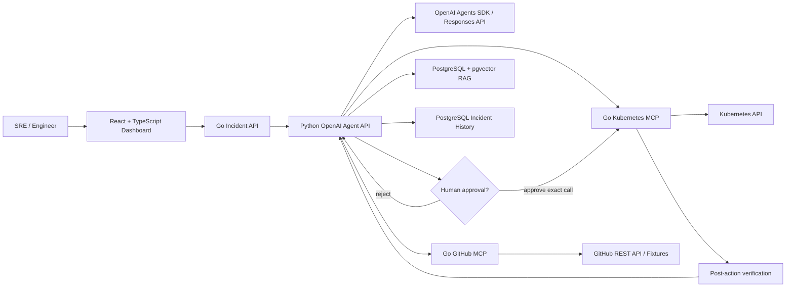
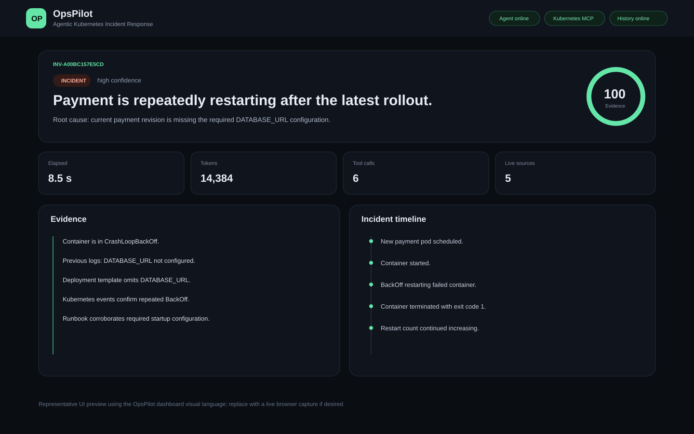
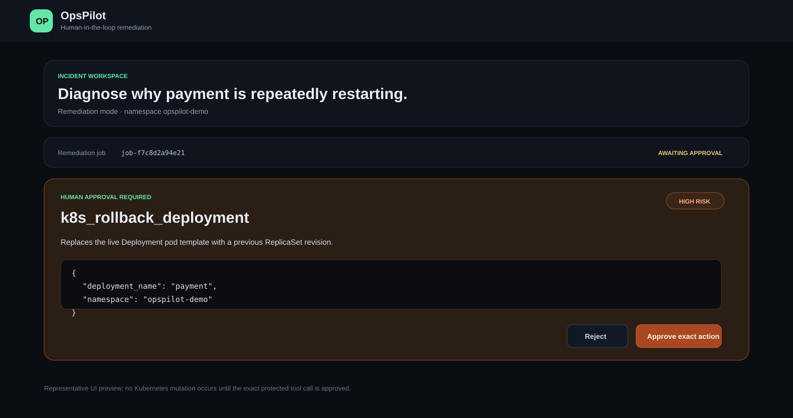

# OpsPilot

**Agentic Kubernetes Incident Response Platform**

OpsPilot is a production-style incident-response platform that combines **live Kubernetes diagnostics**, **OpenAI agentic reasoning**, **MCP tool servers**, **PostgreSQL/pgvector RAG**, **GitHub deployment-change intelligence**, and **human-approved remediation** behind a **Go API + React/TypeScript dashboard**.

The project is intentionally evidence-first: RAG and source history can support a diagnosis, but high-confidence conclusions require live Kubernetes evidence. Mutating actions are disabled by default and require narrow RBAC plus exact human approval.

## Architecture



### Request flow

1. The agent inspects pods, deployments, logs, and events through the read-only Kubernetes MCP server.
2. It retrieves relevant runbooks/postmortems from pgvector and, when enabled, correlates deployed revisions with GitHub commits/PRs.
3. OpsPilot builds a structured RCA, deterministic evidence score, timeline, tool record, and run metrics.
4. In remediation mode, restart/scale/rollback calls pause for exact human approval before the Go MCP server can mutate Kubernetes.
5. Completed investigations and remediation history are persisted to PostgreSQL and can be reopened in the dashboard.

## Dashboard

The React/TypeScript UI supports live investigations, remediation jobs, exact HITL approval, structured evidence/timeline views, source-change correlation, run metrics, and persisted incident history.






## What OpsPilot implements

- **Kubernetes MCP (Go):** pods, logs, events, deployments, restart, scale, and rollback.
- **GitHub MCP (Go):** commits, comparisons, pull-request correlation, fixture and live modes.
- **Agent orchestration (Python):** OpenAI Agents SDK, structured RCA, deterministic assessment/timeline, HITL pause/resume.
- **RAG:** explicit Markdown → embeddings → PostgreSQL/pgvector pipeline; no LangChain dependency.
- **Safety:** read-only by default, separate remediation RBAC, write-tool feature flag, per-call approval, post-action verification.
- **Incident API (Go):** single gateway used by the frontend for investigations, history, and remediation jobs.
- **Dashboard (React + TypeScript):** live RCA, incident history, evidence, metrics, and approvals.
- **Persistence:** normalized `operations` schema plus full JSONB report replay.
- **Evaluation:** deterministic scoring and controlled Kubernetes incident injection.
- **CI:** Go tests, Python tests, TypeScript typecheck/build, and Kustomize manifest validation.

## Measured benchmark results

The primary benchmark uses **10 controlled scenarios × 3 repeats = 30 investigations** with `gpt-5.4-mini` on a local `kind` cluster. The 10 scenarios include nine failures plus a healthy control. A case passes at an evaluation score of at least 80/100.

| Metric | Final 30-run result |
|---|---:|
| Pass rate | **83.33%** |
| Root-cause accuracy | **91.11%** |
| Status accuracy | **76.67%** |
| Required-tool coverage | **96.67%** |
| Remediation recommendation coverage | **100.00%** |
| Average evaluation score | **88.36 / 100** |
| Median investigation latency | **8.481 s** |
| P95 investigation latency | **12.934 s** |
| Average tool calls | **5.03** |
| Total tokens | **469,576** |
| Estimated text-token cost | **$0.4365** |

A separate four-case GitHub fixture benchmark achieved **87.50% deployment-change correlation**, 90.83% required-tool coverage, and a median investigation latency of 14.764 s.

### Benchmark scenarios

| Case | Scenario |
|---|---|
| INC-001 | Missing `DATABASE_URL` / CrashLoopBackOff |
| INC-002 | Memory limit / OOMKilled |
| INC-003 | Broken readiness probe |
| INC-004 | Downstream timeout |
| INC-005 | Invalid image / ImagePullBackOff |
| INC-006 | Missing Kubernetes Secret / CreateContainerConfigError |
| INC-007 | Invalid downstream DNS/configuration |
| INC-008 | Broken liveness probe |
| INC-009 | Application/probe port mismatch |
| INC-010 | Healthy control / false-positive check |

The RAG on/off experiment was only one stochastic run per scenario. It is retained as a descriptive ablation rather than used to claim that RAG universally improves accuracy. Full recorded results and limitations are in [`benchmarks/results/final-2026-09-10.md`](benchmarks/results/final-2026-09-10.md).

## Example investigation

For INC-001, OpsPilot observed a newly rolled-out `payment` pod repeatedly restarting, retrieved previous container logs showing that `DATABASE_URL` was not configured, confirmed the environment variable was absent from the live Deployment template, and corroborated the failure with Kubernetes events and the payment configuration runbook.

```text
Status:      incident
Confidence:  high
Root cause:  payment cannot start because DATABASE_URL is missing
Live proof:  CrashLoopBackOff + previous logs + Deployment template + events
Action:      rollback deployment/payment to its previous ReplicaSet revision
Safety:      protected tool call pauses for human approval
Verification: re-check Deployment/pods/logs after the approved rollback
```

## Safety model

OpsPilot treats LLM output as a decision aid, not infrastructure authority.

```text
Default Kubernetes MCP: read-only
        ↓
Write tools feature flag must be enabled
        ↓
Separate least-privilege remediation Role/RoleBinding
        ↓
Only restart / scale / rollback are exposed
        ↓
Agents SDK pauses the exact protected tool call
        ↓
Human approves or rejects exact arguments
        ↓
Go MCP executes only after approval
        ↓
Agent verifies recovery with fresh live evidence
```

Additional guardrails:

- No arbitrary `kubectl`, Secret editing, RBAC mutation, or resource deletion tools.
- Scaling is bounded by `OPSPILOT_REMEDIATION_MAX_REPLICAS`.
- RAG cannot establish live cluster state by itself.
- GitHub commits are not treated as causal merely because they are recent; deployed revision provenance and the diff must correlate with live symptoms.
- Sensitive environment values are redacted from normalized MCP output.
- Incident-history persistence failures do not prevent the live RCA from being returned.

## Stack

**Go 1.27.1**, **Python 3.11+**, **TypeScript + React**, OpenAI Agents SDK / Responses API, MCP, Kubernetes, kind, Docker, PostgreSQL, pgvector, FastAPI, GitHub REST API, Kustomize, Vite.

## Quick start

### Prerequisites

- Docker
- kind
- kubectl
- Go 1.27.1
- Python 3.11+
- Node.js 22+
- PostgreSQL with pgvector
- OpenAI API key

Copy the safe configuration template and add your local credentials:

```bash
cp .env.example .env
```

### Bootstrap

```bash
make verify
make cluster-up
make build-images
make load-images
make deploy-base
make phase2-up
make agent-setup
make db-create
make db-init
make rag-ingest
make dashboard-setup
```

### Run the platform

Use separate terminals:

```bash
# Kubernetes MCP
make port-forward-k8s-mcp

# GitHub MCP: fixture for deterministic demo incidents, or live for the real repository
make github-mcp-server-fixture

# Python agent API with web HITL jobs
make agent-api-remediation

# Go gateway
make incident-api

# React/TypeScript UI
make dashboard
```

Open `http://localhost:5173`.

For a rollback-capable HITL demo:

```bash
make incident-1-rollout
```

Then select **Remediate** in the dashboard. OpsPilot should diagnose the missing `DATABASE_URL`, request `k8s_rollback_deployment`, pause for approval, execute only if approved, and verify recovery.

## Evaluation

Run the 10-case benchmark:

```bash
make benchmark
```

Run the final 30-investigation benchmark:

```bash
make benchmark BENCHMARK_REPEATS=3
```

Optional experiments:

```bash
make benchmark-no-rag
make github-mcp-server-fixture   # separate terminal
make benchmark-change
```

Artifacts are written under `.opspilot/benchmarks/` as JSON, CSV, and Markdown.

## CI/CD

`.github/workflows/ci.yml` runs on pushes to `main` and pull requests. It executes:

```text
Go tests across all six Go modules
Python agent/unit tests
TypeScript typecheck + Vite production build
Kustomize rendering + kubectl client-side manifest validation
```

Run the closest local equivalent with:

```bash
make phase11-check
```

or validate Kubernetes manifests alone with:

```bash
make validate-manifests
```

## Repository layout

```text
apps/dashboard/                    React + TypeScript operations UI
services/agent/                    Python agent, RAG, evals, persistence, benchmarks
services/k8s-mcp-server/           Go Kubernetes MCP server
services/github-mcp-server/        Go GitHub MCP server
services/incident-api/             Go dashboard/API gateway
demo/services/                     Go demo microservices
demo/incidents/                    deterministic failure overlays
infra/postgres/                    pgvector + operations persistence schema
infra/kubernetes/                  MCP deployment/RBAC
knowledge/                         runbooks, incidents, architecture, postmortems
evals/                             deterministic evaluation cases
benchmarks/                        benchmark scenarios/results
.github/workflows/ci.yml           final CI workflow
```

## Known limitations

- The benchmark runs against a controlled local `kind` environment rather than a production cluster.
- LLM execution is stochastic; the 30-run result is more representative than any individual run.
- GitHub change-correlation benchmark data for INC-001–004 is deterministic fixture history; live mode is also implemented for real repositories.
- Remediation job coordination is in-memory while completed investigations/actions are persisted to PostgreSQL.
- The current product intentionally exposes only a narrow remediation surface rather than arbitrary infrastructure writes.

## Project status

**Complete.** The project now covers investigation, evidence-backed RCA, RAG, deployment-change intelligence, HITL remediation, persistence, a TypeScript/React dashboard, deterministic evaluation, measured benchmarks, and CI validation.

